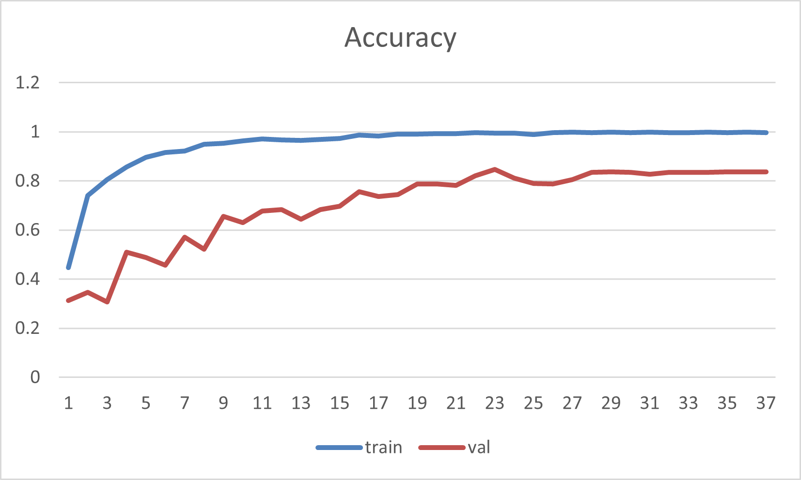

# Overview
Experiment the ensemble technique (soft voting) mentioned in the paper:  
[Fossil Image Identification using Deep Learning
Ensembles of Data Augmented Multiviews](https://arxiv.org/abs/2302.08062)

# Requirement
- pandas
- scikit-learn
- scikit-image
- opencv-python
- tqdm

# Data
- __Download__   
url: https://repository.deep-time.org/detail/1591288605468725250

- __Split the data and transform them into multiviews__  
After unzip the data, type the command below, you will see multiviews which is splitted into `train`, `val`, `test` in the `save_dir`.
```
python dataset.py -data Fusulinid-images-2400\Original_images -save_dir fossil -seed 10
```

# Train
```
python train.py -data fossil -bs 64 -lr 0.01 -end_lr 0.0001 -seed 1000
```

# Evaluate the soft-voting result on the test data
```
python test.py -data fossil -weight weight
```

# Result
- __Training__  


- __Accuracy on test data__  

  | origin  | soft voting |
  | :-----: | :-----:     |
  | 0.84 | 0.88 |  
  
  The soft voting technique really increase the accuracy.
